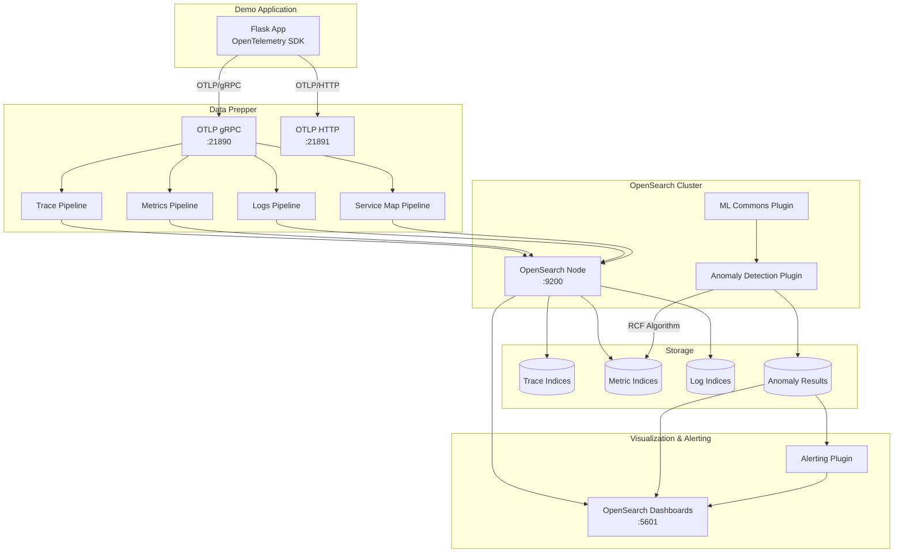
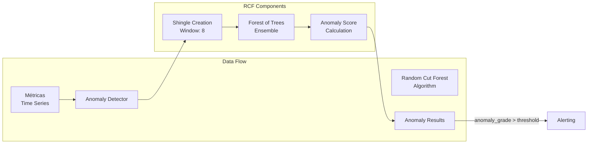
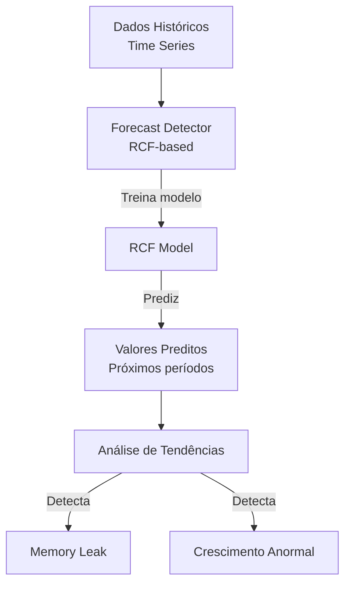
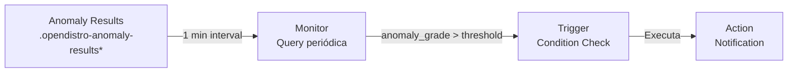

# Arquitetura da POC OpenSearch + Data Prepper

## Visão Geral



## Fluxo de Dados

### 1. Geração de Telemetria

A aplicação demo (`app.py`) está instrumentada com OpenTelemetry SDK:

```python
# Traces
tracer = trace.get_tracer(__name__)
with tracer.start_as_current_span("operation"):
    # código instrumentado

# Metrics
meter = metrics.get_meter(__name__)
counter = meter.create_counter("metric_name")
counter.add(1, {"label": "value"})

# Logs
logger = logging.getLogger(__name__)
logger.info("message", extra={"trace_id": trace_id})
```

### 2. Exportação OTLP

Telemetria é exportada via OTLP (OpenTelemetry Protocol):

- **Protocolo**: gRPC (porta 21890) ou HTTP (porta 21891)
- **Formato**: Protobuf
- **Destino**: Data Prepper
- **Batch**: Exportação em lotes para eficiência

### 3. Processamento no Data Prepper

Data Prepper processa cada tipo de sinal:

#### Traces Pipeline
```yaml
trace-pipeline:
  source: otel_trace_source
  processor:
    - otel_trace_raw
    - otel_traces_group
  sink: opensearch (trace-analytics-raw)
```

#### Metrics Pipeline
```yaml
metrics-pipeline:
  source: otel_metrics_source
  processor:
    - otel_metrics
  sink: opensearch (otel-metrics-*)
```

#### Logs Pipeline
```yaml
logs-pipeline:
  source: otel_logs_source
  processor:
    - grok (parsing)
    - date (timestamp)
  sink: opensearch (otel-logs-*)
```

### 4. Armazenamento no OpenSearch

Dados são indexados em índices específicos:

| Tipo | Índice | Características |
|------|--------|-----------------|
| Traces | `otel-v1-apm-span-*` | Spans com contexto distribuído |
| Metrics | `otel-metrics-*` | Time series com labels |
| Logs | `otel-logs-*` | Logs estruturados com trace correlation |
| Service Map | `otel-v1-apm-service-map` | Grafo de dependências |

## Machine Learning com Random Cut Forest

### Arquitetura do RCF



### Como o RCF Funciona

1. **Shingle Creation**: Agrupa pontos de dados em janelas (shingle_size=8)
2. **Tree Construction**: Constrói árvores de corte aleatório
3. **Anomaly Scoring**: Calcula score baseado em profundidade na árvore
4. **Grade Calculation**: Normaliza score para 0-1 (anomaly_grade)

### Detectores Configurados

#### CPU Usage Detector
```json
{
  "name": "cpu-usage-detector",
  "feature": "avg(value) where name=system_cpu_usage",
  "detection_interval": "1 minute",
  "shingle_size": 8
}
```

**Detecta:**
- Spikes súbitos de CPU
- Padrões anormais de utilização
- Desvios do comportamento baseline

#### Memory Usage Detector
```json
{
  "name": "memory-usage-detector",
  "feature": "avg(value) where name=system_memory_usage",
  "detection_interval": "1 minute",
  "shingle_size": 8
}
```

**Detecta:**
- Memory leaks (crescimento gradual)
- Spikes de memória
- Padrões de vazamento

#### Request Latency Detector
```json
{
  "name": "request-latency-detector",
  "feature": "avg(value) where name=http_request_duration_seconds",
  "detection_interval": "1 minute",
  "shingle_size": 8
}
```

**Detecta:**
- Latências anormalmente altas
- Degradação de performance
- Padrões de slow requests

## Forecasting

### Arquitetura de Forecast



### Forecasts Configurados

1. **CPU Forecast**: Prediz uso de CPU nos próximos períodos
2. **Memory Forecast**: Identifica tendências de crescimento (leaks)

**Intervalo de detecção**: 5 minutos (mais longo para forecast)

## Alerting

### Arquitetura de Alertas



### Monitores Configurados

| Monitor | Threshold | Severity | Descrição |
|---------|-----------|----------|-----------|
| CPU Anomaly Alert | grade > 0.7 | 1 (High) | Alerta em spikes de CPU |
| Memory Anomaly Alert | grade > 0.7 | 2 (Medium) | Alerta em anomalias de memória |
| Latency Anomaly Alert | grade > 0.6 | 3 (Low) | Alerta em latências anormais |

### Fluxo de Alerta

1. **Monitor** executa query a cada 1 minuto
2. **Query** busca anomalias recentes (últimos 5 min)
3. **Trigger** avalia condição (anomaly_grade > threshold)
4. **Action** dispara notificação (log, webhook, etc.)

## Componentes Docker

### OpenSearch Node
```yaml
Image: opensearchproject/opensearch:2.11.1
Portas: 9200 (API), 9600 (Performance Analyzer)
Plugins:
  - ML Commons (machine learning)
  - Anomaly Detection (RCF)
  - Alerting
```

### Data Prepper
```yaml
Image: opensearchproject/data-prepper:2.6.1
Portas: 
  - 21890 (OTLP gRPC)
  - 21891 (OTLP HTTP)
  - 4900 (Server)
Pipelines: traces, metrics, logs, service-map
```

### OpenSearch Dashboards
```yaml
Image: opensearchproject/opensearch-dashboards:2.11.1
Porta: 5601
Features:
  - Trace Analytics
  - Anomaly Detection UI
  - Alerting UI
  - Dashboards & Visualizations
```

### Demo Application
```yaml
Image: Custom (Python 3.11)
Porta: 8080
Instrumentação:
  - OpenTelemetry SDK
  - Flask auto-instrumentation
  - Custom metrics & spans
```

## Índices e Schemas

### Trace Index
```
otel-v1-apm-span-*
├── traceId
├── spanId
├── parentSpanId
├── name
├── startTime
├── endTime
├── attributes
└── events
```

### Metrics Index
```
otel-metrics-*
├── @timestamp
├── name (metric name)
├── value
├── labels
├── unit
└── type (gauge, counter, histogram)
```

### Anomaly Results Index
```
.opendistro-anomaly-results*
├── detector_id
├── anomaly_grade (0-1)
├── confidence
├── feature_data
├── execution_start_time
└── execution_end_time
```

## Performance e Escalabilidade

### Configurações de Performance

| Componente | Setting | Valor | Propósito |
|------------|---------|-------|-----------|
| Data Prepper | buffer_size | 512 | Buffer de eventos |
| Data Prepper | batch_size | 8 | Tamanho do batch |
| OpenSearch | heap | 512m | Memória JVM |
| RCF | shingle_size | 8 | Janela de observação |

### Escalabilidade

Para produção, considere:

1. **OpenSearch Cluster**: Múltiplos nodes (data, master, ML)
2. **Data Prepper**: Múltiplas instâncias com load balancer
3. **Índices**: Sharding e replica configuration
4. **ILM**: Index Lifecycle Management para rotação

## Segurança

### Configuração Atual (POC)
- Security plugin habilitado
- SSL/TLS desabilitado (simplicidade)
- Credenciais padrão (admin/admin)

### Produção Recomendada
- ✅ SSL/TLS em todos os componentes
- ✅ Autenticação forte (LDAP, SAML)
- ✅ RBAC (Role-Based Access Control)
- ✅ Audit logging
- ✅ Network policies

## Monitoramento da Stack

### Métricas do Data Prepper
```bash
curl http://localhost:4900/metrics/prometheus
```

### Métricas do OpenSearch
```bash
curl -u admin:admin http://localhost:9200/_cluster/stats
curl -u admin:admin http://localhost:9200/_nodes/stats
```

### Health Checks
```bash
# OpenSearch
curl -u admin:admin http://localhost:9200/_cluster/health

# Demo App
curl http://localhost:8080/health
```

## Próximos Passos

Para expandir esta POC:

1. **Adicionar mais aplicações** com diferentes padrões
2. **Configurar ILM** para gerenciamento de índices
3. **Criar dashboards customizados** no OpenSearch Dashboards
4. **Integrar notificações** (Slack, PagerDuty, etc.)
5. **Testar forecasting** com dados de longo prazo
6. **Implementar RBAC** e segurança completa
7. **Escalar para cluster** multi-node
